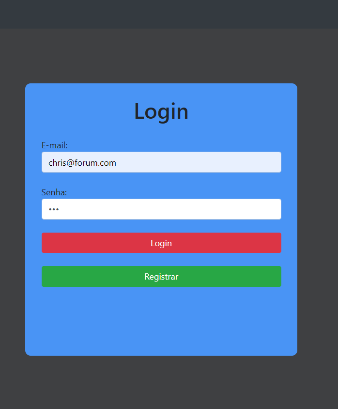
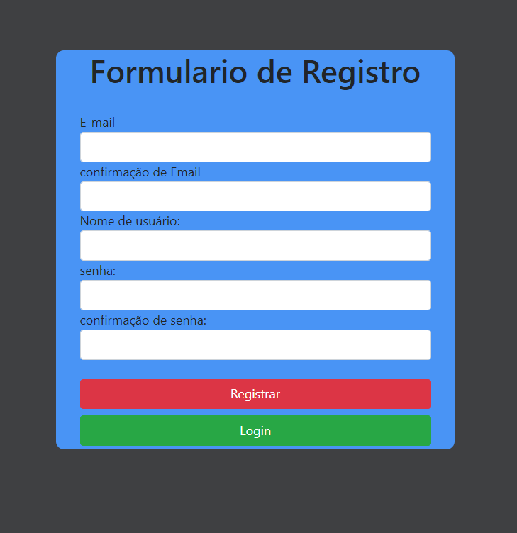
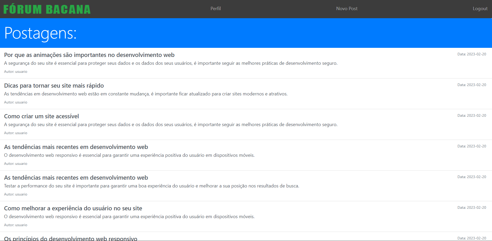
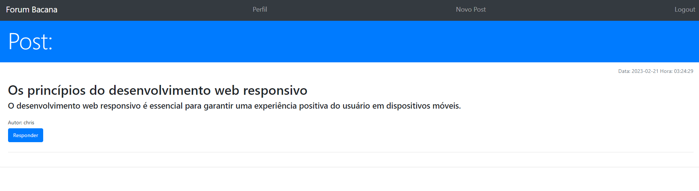
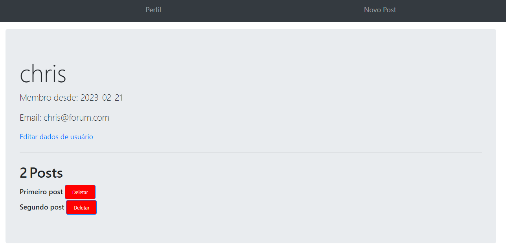

Projeto de um fórum

## Tecnologia

Aqui estão as tecnologias utilizadas neste projeto.

* HTML5
* CSS3
* JavaScript
* Php 
* MySQL
* Bootstrap 

## Serviços Utilizados

* GitLab
* Apache2 

## Começando

* Para criar e construir seu banco de dados de acordo com o projeto.
   - abra o aquivo createdb.php
  

## Como usar

### 1 - Ao acessar, você verá a página de Login <3

### 2 - Página de registro

### 2 - Você também pode ver muitas informações na sessão de postagens do Blog (home.php).

### 3 Publique algo de se interesse em "Novo Post"

### 4 - Ou acesse algum dos posts :D

### 5 - Você também pode ver seu perfil e excluir seus posts

### ;6 - Edite seus dados

## Características
As principais características do aplicativo são:
  - Publicar posts.
  - Comentar postagens
  - Acesso somente com login

## Links
   - link1
   - link2
   
   ## Versionamento

   1.0.3

   ## Autores

   * <a href="https://gitlab.com/AliresRosa"> Alires</a> GRR20200010
   * <a href="https://gitlab.com/chrisnotads2020"> Christian</a> GRR20206127
   * <a href="https://gitlab.com/Marcosflr"> Marcos</a> GRR20211592
   * <a href="https://gitlab.com/SamuelDozSantos"> Samuel</a> GRR20210544

   
   Obrigado pela visita e boa codificação! 👍